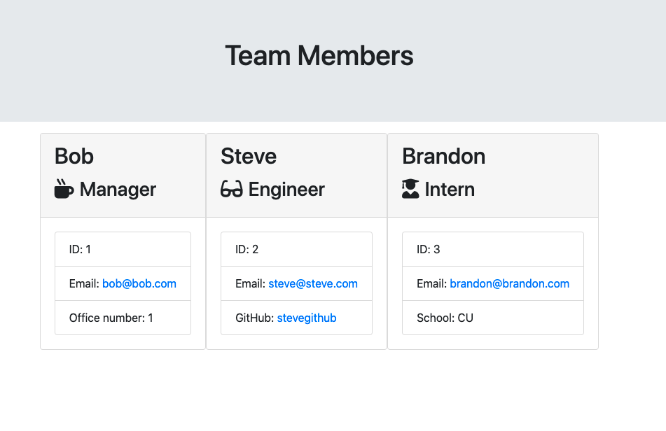

# Team profile generator

This application uses a series of CLI prompts to create a team of employees for a fabricated company. It then creates an output directory and a team.html file to display the information about the team. Additionally, this application uses testing to test the code and ensure it functions.

## Installation/Usage

To view this application, run an npm i in your CLI to pull down dependencies. Run node app.js to begin the prompts and build the team. To test the code run npm test.

## Technologies

This application uses JS and HTML. It also jest to run the tests, inquirer to run the prompts and fs to write the html file.
